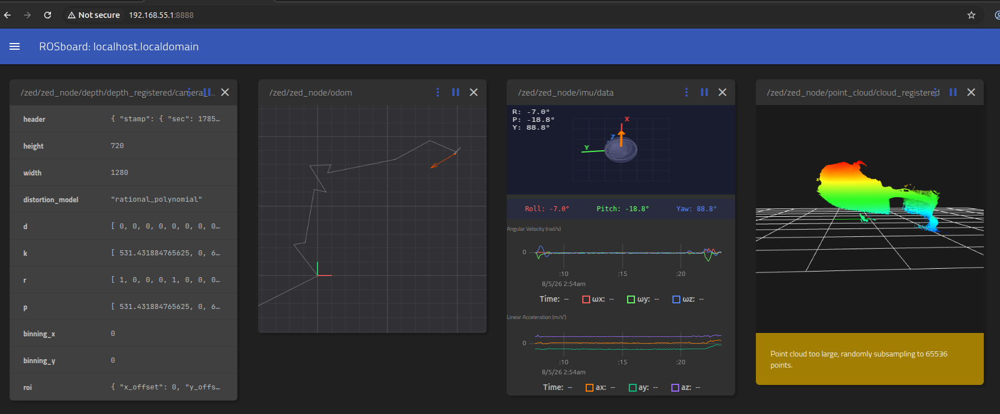

# ZED-2i Camera Setup (Orin Nano)

## Prerequisites

* JetPack 7.2 flashed (Ubuntu 24.04 from Nvidia SDK manager) and then ROS 2 Jazzy installed (from apt)
* ZED-2i connected to a USB 3.0 port on the Orin

## Install

1. **ZED SDK 5.4** — download the Jetson/JetPack 7.2 installer from [stereolabs.com/developers/release](https://www.stereolabs.com/developers/release/), then:
   ```bash
   chmod +x ZED_SDK_Installer.run
   ./ZED_SDK_Installer.run
   ```
   Decline the full AI model optimization prompt (Y/n) unless you need every depth/detection mode — it can take hours. The NEURAL depth model needed for normal use is optimized automatically during install.

2. **zed-ros2-wrapper** — built from source (no Jazzy apt binary yet):
   ```bash
   mkdir -p ~/ros2_ws/src && cd ~/ros2_ws/src
   git clone https://github.com/stereolabs/zed-ros2-wrapper.git
   cd ~/ros2_ws
   rosdep install --from-paths src --ignore-src -r -y
   colcon build --symlink-install --cmake-args=-DCMAKE_BUILD_TYPE=Release --parallel-workers $(nproc)
   ```

3. **rosboard** — browser-based topic viewer, self-hosted (no external CDN dependency and eliminates the need for connecting the display to Orin):
   ```bash
   git clone https://github.com/dheera/rosboard.git ~/rosboard
   sudo pip3 install --break-system-packages tornado simplejpeg
   ```
   Two patches are required against the numpy 2.x installed by the ZED SDK's Python API, without them rosboard crashes were observed on `/point_cloud/cloud_registered`:
   ```bash
   # np.nbytes removed in numpy 2.0
   sed -i 's/np\.nbytes\[field_np_datatype\]/np.dtype(field_np_datatype).itemsize/' ~/rosboard/rosboard/compression.py

   # tolerate point cloud frames with zero points after NaN filtering
   sed -i 's/^        ros_msg_dict = ros2dict(msg)$/        try:\n            ros_msg_dict = ros2dict(msg)\n        except Exception as e:\n            self.get_logger().warn("failed to convert message on topic %s: %s" % (topic_name, e))\n            return/' ~/rosboard/rosboard/rosboard.py
   ```

## Visualize

Run [`launch_zed.sh`](launch_zed.sh) to start the camera node and rosboard together (Ctrl-C stops both):
```bash
./launch_zed.sh
```

It passes [`config/cfr_zed2i.yaml`](config/cfr_zed2i.yaml) as `ros_params_override_path`, which pins positional tracking rather than inheriting whatever the installed wrapper defaults to. The setting that matters is `area_memory`, the SDK's loop closure: `lap_counter_node` reads `/zed/zed_node/pose` — the **map** frame pose, which the SDK corrects when it closes a loop — because three laps of the speed course is about 300 m of travel returning to the same spot, and `/zed/zed_node/odom` is pure visual odometry that is deliberately never corrected. `two_d_mode` is on as well, since the car is a ground vehicle.

Confirm it took, on the car:
```bash
ros2 param get /zed/zed_node pos_tracking.area_memory
```

Note that `reset_odom_with_loop_closure` is left at the wrapper's default of true, which means `/zed/zed_node/odom` is re-initialized when a loop closes — so nothing should treat that topic as continuous either.

Or start them manually in separate terminals:

1. Launch the camera node:
   ```bash
   source ~/ros2_ws/install/setup.bash
   ros2 launch zed_wrapper zed_camera.launch.py camera_model:=zed2i
   ```
2. In a second terminal, launch rosboard:
   ```bash
   cd ~/rosboard
   source /opt/ros/jazzy/setup.bash
   ./run
   ```

Either way, from a browser on a machine networked to the Orin, go to `http://<orin-ip>:8888` and select a topic (e.g. `/zed/zed_node/point_cloud/cloud_registered` or `/zed/zed_node/rgb/color/rect/image`) to visualize it.


## ROS 2 Topics

These are all the topics observed from ZED:

| Topic | Description |
| ----- | ----------- |
| `/zed/joint_states` | Joint states for the camera's URDF model |
| `/zed/zed_description` | Robot description (URDF) |
| `/zed/zed_node/depth/camera_info` | Depth camera intrinsics |
| `/zed/zed_node/depth/depth_registered` | Depth image registered to RGB frame |
| `/zed/zed_node/depth/depth_registered/camera_info` | Camera info for registered depth |
| `/zed/zed_node/depth/depth_registered/compressedDepth` | Compressed depth image |
| `/zed/zed_node/depth/depth_registered/zstd` | zstd-compressed depth image |
| `/zed/zed_node/imu/data` | IMU data |
| `/zed/zed_node/odom` | Visual-inertial odometry; no loop closure, and reset when one happens |
| `/zed/zed_node/point_cloud/cloud_registered` | Registered colored point cloud |
| `/zed/zed_node/pose` | Camera pose in the map frame, loop closure applied; what `lap_counter_node` reads |
| `/zed/zed_node/pose/status` | Positional tracking status |
| `/zed/zed_node/rgb/color/rect/camera_info` | RGB camera intrinsics |
| `/zed/zed_node/rgb/color/rect/image` | Rectified RGB image |
| `/zed/zed_node/rgb/color/rect/image/camera_info` | Camera info for rectified RGB image |
| `/zed/zed_node/rgb/color/rect/image/compressed` | JPEG-compressed rectified RGB image |
| `/zed/zed_node/rgb/color/rect/image/theora` | Theora-compressed rectified RGB image |
| `/zed/zed_node/rgb/color/rect/image/zstd` | zstd-compressed rectified RGB image |
| `/zed/zed_node/status/health` | Node/camera health status |
| `/zed/zed_node/status/heartbeat` | Node heartbeat |
